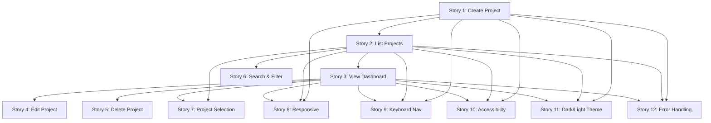

# TestForge — Sprint 01: Project Foundation

## User Stories

**Document Version:** 1.0
**Sprint:** Sprint 01
**Date:** 2026-07-25
**Author:** Lead Product Architect

---

## Story Template

All stories follow the standard format:

> **As a** `<role>`  
> **I want** `<goal>`  
> **So that** `<benefit>`

Each story includes:
- **Priority** (P0: Must have, P1: Should have, P2: Nice to have)
- **Story Points** (T-shirt sizing: XS, S, M, L, XL)
- **Acceptance Criteria** (numbered, testable conditions)
- **Dependencies** (other stories or external factors)

---

## Story 1: Create a New Project

| Field | Value |
|-------|-------|
| **Priority** | P0 |
| **Story Points** | S |
| **Dependencies** | None |
| **Epic** | Project Management |

**As a** QA Engineer  
**I want** to create a new project by entering a project ID and optional name  
**So that** I can organize my API testing work within a dedicated workspace

### Acceptance Criteria

1. The create project form has two input fields: "Project ID" (required) and "Project Name" (optional).
2. The Project ID field has a placeholder showing an example (e.g., `payments-api`).
3. The Project Name field has a placeholder showing an example (e.g., `Payments API`).
4. If the Project Name is left blank, it defaults to the Project ID value on creation.
5. The "Create Project" button is disabled when the Project ID field is empty.
6. The "Create Project" button shows a loading spinner when the request is in progress.
7. Pressing the Enter key in either input field triggers the create action.
8. On successful creation, the user is navigated to the project dashboard.
9. On failure (duplicate ID), a clear error message is displayed below the form.
10. On failure (network error), a user-friendly error message is displayed with a retry option.
11. After successful creation, the new project appears in the project list immediately.
12. The Project ID field validates input in real-time (alphanumeric, hyphens, underscores, dots only).

### UI States

- **Default:** Empty form with placeholders, button disabled
- **Typing:** Real-time validation feedback on Project ID
- **Loading:** Button shows spinner, all inputs disabled
- **Error:** Red error message below form, inputs remain editable
- **Success:** Redirect to dashboard (no success message on form page)

---

## Story 2: List and Select Projects

| Field | Value |
|-------|-------|
| **Priority** | P0 |
| **Story Points** | M |
| **Dependencies** | Story 1 (Create Project) |
| **Epic** | Project Management |

**As a** QA Engineer  
**I want** to see a list of all my projects and select one to work with  
**So that** I can quickly find and switch between different API testing projects

### Acceptance Criteria

1. The project setup page displays all existing projects in a list.
2. The default project (`default`) is always present in the list.
3. Each project in the list displays: project name, project ID, and last updated timestamp.
4. Projects are sorted alphabetically by ID by default.
5. Clicking a project in the list navigates to its dashboard.
6. A search input is available above the project list.
7. Typing in the search input filters projects in real-time (case-insensitive).
8. Search matches both project ID and project name.
9. When no projects match the search, a "no results" empty state is shown.
10. When there are no projects at all (excluding default), an empty state with a call-to-action is shown.
11. The project list loads within 500ms for up to 100 projects.
12. A loading spinner is shown while the project list is being fetched.
13. If the project list fails to load, a retry button is displayed.

### UI States

- **Loading:** Spinner centered in the list area
- **Empty (no projects):** Illustration + message + "Create your first project" CTA
- **Empty (search no results):** Message "No projects match your search" + "Clear search" link
- **Populated:** Scrollable list of project cards/rows
- **Error:** Error message + retry button

---

## Story 3: View Project Dashboard

| Field | Value |
|-------|-------|
| **Priority** | P0 |
| **Story Points** | M |
| **Dependencies** | Story 2 (List Projects) |
| **Epic** | Project Management |

**As a** QA Engineer  
**I want** to view a project dashboard with all project details and next steps  
**So that** I can understand the project's current state and what actions are available

### Acceptance Criteria

1. The dashboard displays the project name as the page title.
2. The dashboard displays the project ID below the name.
3. The dashboard displays the creation date in a human-readable format.
4. The dashboard displays the last updated date in a human-readable format.
5. The dashboard shows a status indicator for API import: "Not configured" (since APIs are not yet imported).
6. The dashboard provides a "Change Project" button that returns to the project setup page.
7. The dashboard provides an "Edit Project" button that opens the edit project dialog.
8. The dashboard provides a "Delete Project" button that opens the delete confirmation dialog.
9. The dashboard shows a "Next Steps" section with guidance on what to do next (e.g., "Import APIs to get started").
10. The dashboard loads within 500ms.
11. If the project is not found (e.g., deleted in another session), the user is redirected to the project setup page with an error message.
12. The dashboard shows a breadcrumb or back link to the project list.

### UI States

- **Loading:** Skeleton placeholders for dashboard content
- **Loaded:** Full dashboard with all sections
- **Error (project not found):** Redirect to setup page with error toast
- **Empty (no APIs):** Status indicator shows "Not configured" with guidance

### Dashboard Sections

1. **Header:** Project name, ID, dates, quick action buttons
2. **Project Status:** Overview of project state (no APIs yet)
3. **Next Steps:** Guidance on what to do next
4. **Quick Actions:** Edit, Delete, Change Project

---

## Story 4: Edit Project Name

| Field | Value |
|-------|-------|
| **Priority** | P1 |
| **Story Points** | S |
| **Dependencies** | Story 3 (View Dashboard) |
| **Epic** | Project Management |

**As a** QA Engineer  
**I want** to edit the name of an existing project  
**So that** I can keep my projects organized with meaningful names

### Acceptance Criteria

1. The "Edit Project" button on the dashboard opens a modal dialog.
2. The modal dialog has a title "Edit Project".
3. The modal dialog has a text input pre-filled with the current project name.
4. The modal dialog has "Save" and "Cancel" buttons.
5. The "Save" button is disabled when the input is empty.
6. The "Save" button shows a loading spinner when the update request is in progress.
7. On successful save, the modal closes and the dashboard reflects the new name.
8. On cancel, the modal closes without making any changes.
9. On failure, an error message is displayed in the modal.
10. The "Save" button can be triggered via Enter key when the input is focused.
11. The "Cancel" button can be triggered via Escape key.
12. The modal is accessible (focus trap, ARIA attributes, escape to close).

### UI States

- **Default:** Modal with pre-filled name, Save disabled if empty
- **Typing:** Save enabled when input is non-empty
- **Loading:** Save button shows spinner, all inputs disabled
- **Error:** Red error message in modal, inputs remain editable
- **Success:** Modal closes, dashboard updates

---

## Story 5: Delete Project

| Field | Value |
|-------|-------|
| **Priority** | P1 |
| **Story Points** | S |
| **Dependencies** | Story 3 (View Dashboard) |
| **Epic** | Project Management |

**As a** QA Engineer  
**I want** to delete a project I no longer need  
**So that** my project list stays clean and organized

### Acceptance Criteria

1. The "Delete Project" button on the dashboard opens a confirmation modal dialog.
2. The confirmation modal has a title "Delete Project".
3. The confirmation modal displays the project name and ID being deleted.
4. The confirmation modal requires the user to type the project ID to enable the "Delete" button.
5. The "Delete" button is disabled until the user types the exact project ID.
6. The "Delete" button shows a loading spinner when the delete request is in progress.
7. On successful deletion, the user is redirected to the project setup page.
8. On cancel, the modal closes without deleting anything.
9. On failure, an error message is displayed in the modal.
10. The default project cannot be deleted — the delete button is hidden or disabled for the default project.
11. The "Cancel" button can be triggered via Escape key.
12. The modal is accessible (focus trap, ARIA attributes, escape to close).

### UI States

- **Default:** Modal with project details, Delete button disabled
- **Typing ID:** Delete button enabled when input matches project ID exactly
- **Loading:** Delete button shows spinner, all inputs disabled
- **Error:** Red error message in modal
- **Success:** Redirect to setup page

---

## Story 6: Search and Filter Projects

| Field | Value |
|-------|-------|
| **Priority** | P1 |
| **Story Points** | S |
| **Dependencies** | Story 2 (List Projects) |
| **Epic** | Project Management |

**As a** QA Engineer  
**I want** to search and filter my projects by name or ID  
**So that** I can quickly find the project I'm looking for

### Acceptance Criteria

1. A search input is displayed above the project list.
2. Typing in the search input filters projects in real-time (debounced by 300ms).
3. Search is case-insensitive.
4. Search matches both project ID and project name.
5. When the search input is cleared, all projects are shown.
6. A clear button (×) is shown in the search input when there is text.
7. Clicking the clear button empties the search input and shows all projects.
8. When no projects match the search, a "no results" message is shown.
9. The search input has an accessible label.
10. The search input supports keyboard navigation (Tab to focus, Enter to submit).

### UI States

- **Empty:** Search input with placeholder "Search projects..."
- **Typing:** Real-time filtering, clear button visible
- **No Results:** "No projects match your search" message
- **Results:** Filtered list of projects

---

## Story 7: Project Selection / Activation

| Field | Value |
|-------|-------|
| **Priority** | P0 |
| **Story Points** | S |
| **Dependencies** | Story 2 (List Projects), Story 3 (View Dashboard) |
| **Epic** | Project Management |

**As a** QA Engineer  
**I want** to select and activate a project to work within its context  
**So that** all subsequent actions (API import, test generation, etc.) are scoped to the correct project

### Acceptance Criteria

1. Clicking a project in the list sets it as the active project.
2. When a project is active, the dashboard is displayed.
3. The active project ID is stored in application state (React context or similar).
4. The sidebar navigation reflects the current view context.
5. The header displays the active project name.
6. When switching from one active project to another, the dashboard content updates.
7. The "Change Project" button on the dashboard returns to the project list.
8. If the active project is deleted, the user is redirected to the project setup page.
9. The active project persists across page reloads (via URL hash or localStorage).
10. The project selection is reflected in the URL (e.g., `#workspace` or `#setup`).

### UI States

- **No Active Project:** Project setup page is shown
- **Active Project:** Dashboard is shown
- **Switching:** Dashboard content updates smoothly
- **Deleted:** Redirect to setup page

---

## Story 8: Responsive Project Management

| Field | Value |
|-------|-------|
| **Priority** | P1 |
| **Story Points** | M |
| **Dependencies** | Stories 1-7 |
| **Epic** | Project Management |

**As a** QA Engineer  
**I want** the project management screens to work on mobile and tablet devices  
**So that** I can manage my projects from any device

### Acceptance Criteria

1. The project setup page is usable on screens as narrow as 360px.
2. On narrow screens, the create project form stacks vertically (fields on separate rows).
3. On narrow screens, the sidebar is hidden and accessible via a hamburger menu toggle.
4. The project dashboard is usable on screens as narrow as 360px.
5. On narrow screens, dashboard action buttons stack vertically or use compact icons.
6. The project list is scrollable on narrow screens.
7. Touch targets are at least 44px × 44px on mobile.
8. The theme switcher is accessible on narrow screens.
9. The font size is readable without zooming on mobile (minimum 14px).
10. The create project button is full-width on narrow screens.

### Breakpoints

| Breakpoint | Width | Behavior |
|-----------|-------|----------|
| Mobile | ≤ 768px | Sidebar hidden, form stacks, buttons full-width |
| Tablet | 769px – 1200px | Sidebar visible, form inline, buttons compact |
| Desktop | ≥ 1201px | Full layout, form inline, buttons normal |

---

## Story 9: Keyboard Navigation

| Field | Value |
|-------|-------|
| **Priority** | P1 |
| **Story Points** | S |
| **Dependencies** | Stories 1-7 |
| **Epic** | Project Management |

**As a** power user  
**I want** to navigate the project management screens using only my keyboard  
**So that** I can work efficiently without switching between keyboard and mouse

### Acceptance Criteria

1. All interactive elements are reachable via Tab key in logical order.
2. The Tab key moves focus to the next interactive element.
3. Shift + Tab moves focus to the previous interactive element.
4. Enter key activates buttons and links.
5. Enter key in the Project ID or Project Name input triggers the create action.
6. Enter key in the edit project name input triggers the save action.
7. Escape key closes modal dialogs.
8. Escape key clears the search input.
9. Focus is visible on all interactive elements (focus ring or outline).
10. Focus is trapped within modal dialogs (Tab cycles within the modal).
11. The initial focus is set to the first input in modal dialogs.
12. Arrow keys can navigate between project list items (up/down).

### Keyboard Shortcuts

| Shortcut | Action | Scope |
|----------|--------|-------|
| `Tab` | Move focus to next element | Global |
| `Shift + Tab` | Move focus to previous element | Global |
| `Enter` | Activate button/link | Global |
| `Enter` | Submit form | Form fields |
| `Escape` | Close modal/clear search | Modal / Search |
| `↑` / `↓` | Navigate project list | Project list |
| `Ctrl/Cmd + K` | Focus search input | Global |

---

## Story 10: Accessibility Compliance

| Field | Value |
|-------|-------|
| **Priority** | P1 |
| **Story Points** | M |
| **Dependencies** | Stories 1-7 |
| **Epic** | Project Management |

**As a** user with disabilities  
**I want** the project management screens to be fully accessible  
**So that** I can use the platform with screen readers and other assistive technologies

### Acceptance Criteria

1. All pages have a valid `<main>` landmark.
2. All pages have a valid `<nav>` landmark for the sidebar.
3. All pages have a valid `<header>` landmark for the header.
4. All form fields have associated `<label>` elements.
5. All buttons have accessible names (text content or `aria-label`).
6. All icons have `aria-hidden="true"` or appropriate `role="img"` with `aria-label`.
7. Modal dialogs have `role="dialog"` and `aria-modal="true"`.
8. Modal dialogs have `aria-labelledby` pointing to the dialog title.
9. Modal dialogs have `aria-describedby` pointing to the dialog description.
10. The project list has `role="list"` and each item has `role="listitem"`.
11. Status indicators use `aria-live` for dynamic updates.
12. Color contrast meets WCAG 2.1 AA standards (4.5:1 for normal text).
13. Focus indicators are visible in both light and dark themes.
14. The theme switcher has `aria-pressed` attributes.
15. Error messages are associated with their form fields via `aria-describedby`.

### WCAG 2.1 AA Checklist

- [ ] 1.1.1 Non-text Content (Level A)
- [ ] 1.3.1 Info and Relationships (Level A)
- [ ] 1.3.2 Meaningful Sequence (Level A)
- [ ] 1.4.3 Contrast (Minimum) (Level AA)
- [ ] 1.4.4 Resize Text (Level AA)
- [ ] 2.1.1 Keyboard (Level A)
- [ ] 2.1.2 No Keyboard Trap (Level A)
- [ ] 2.4.1 Bypass Blocks (Level A)
- [ ] 2.4.3 Focus Order (Level A)
- [ ] 2.4.4 Link Purpose (Level A)
- [ ] 2.4.6 Headings and Labels (Level AA)
- [ ] 2.4.7 Focus Visible (Level AA)
- [ ] 3.1.1 Language of Page (Level A)
- [ ] 3.2.1 On Focus (Level A)
- [ ] 3.2.2 On Input (Level A)
- [ ] 4.1.1 Parsing (Level A)
- [ ] 4.1.2 Name, Role, Value (Level A)

---

## Story 11: Dark/Light Theme Support

| Field | Value |
|-------|-------|
| **Priority** | P0 |
| **Story Points** | S |
| **Dependencies** | Stories 1-7 |
| **Epic** | Project Management |

**As a** user who prefers dark mode  
**I want** the project management screens to support both light and dark themes  
**So that** I can use the platform comfortably in any lighting condition

### Acceptance Criteria

1. The application supports both light and dark themes.
2. The theme preference is persisted in `localStorage` under the key `testforge-theme`.
3. If no preference is stored, the theme follows the system preference (`prefers-color-scheme`).
4. The theme can be toggled via the header theme switcher (Light / Dark buttons).
5. All UI components render correctly in both themes.
6. The theme switcher has `aria-pressed` attributes on both buttons.
7. The theme switcher buttons have visible focus indicators.
8. Theme changes take effect immediately without a page reload.
9. The theme preference persists across page reloads.
10. All colors used in the project management screens have appropriate dark mode equivalents.

### Theme Variables

| Variable | Light | Dark |
|----------|-------|------|
| `--color-bg-app` | `#F7F8FC` | `#0F172A` |
| `--color-bg-surface` | `#FFFFFF` | `#182235` |
| `--color-text-primary` | `#111827` | `#F8FAFC` |
| `--color-border` | `#E5E7EB` | `#334155` |
| `--color-primary` | `#6D5DFB` | `#8B7CFF` |

---

## Story 12: Error Handling and Retry

| Field | Value |
|-------|-------|
| **Priority** | P1 |
| **Story Points** | S |
| **Dependencies** | Stories 1-7 |
| **Epic** | Project Management |

**As a** user  
**I want** to see clear error messages and retry options when something goes wrong  
**So that** I can recover from errors without losing my work

### Acceptance Criteria

1. When the project list fails to load, an error message is displayed with a "Retry" button.
2. When project creation fails, a clear error message is displayed below the form.
3. When project update fails, an error message is displayed in the modal dialog.
4. When project deletion fails, an error message is displayed in the modal dialog.
5. All error messages are user-friendly (no technical jargon or stack traces).
6. Error messages are displayed in a consistent, visible location.
7. Errors do not cause the application to crash or become unresponsive.
8. The "Retry" button re-attempts the failed operation.
9. Error states are dismissible (user can close the error and try again).
10. Network timeouts are handled gracefully with a timeout-specific message.

### Error Types

| Error Type | Message | Retry? |
|-----------|---------|--------|
| Network Error | "Unable to connect to the server. Please check your connection and try again." | Yes |
| Timeout | "The request timed out. Please try again." | Yes |
| Duplicate ID | "A project with this ID already exists. Please choose a different ID." | No |
| Validation Error | "Please enter a valid project ID." | No |
| Server Error (5xx) | "Something went wrong on our end. Please try again later." | Yes |
| Project Not Found | "The project you're looking for no longer exists." | No (redirect) |

---

## Story Priority Matrix

| Priority | Count | Stories |
|----------|-------|---------|
| **P0 (Must Have)** | 5 | 1, 2, 3, 7, 11 |
| **P1 (Should Have)** | 6 | 4, 5, 6, 8, 9, 10, 12 |
| **P2 (Nice to Have)** | 0 | — |

---

## Story Dependencies

---

## Story Sizing Reference

| Size | Estimated Effort | Description |
|------|-----------------|-------------|
| **XS** | 1-2 hours | Small UI changes, single component |
| **S** | 4-8 hours | Single feature, 1-2 components, basic logic |
| **M** | 1-2 days | Multi-component feature, moderate logic |
| **L** | 3-5 days | Complex feature, multiple screens, integration |
| **XL** | 1+ weeks | Epic-level feature, cross-cutting concerns |

---

*End of User Stories — Sprint 01: Project Foundation*
