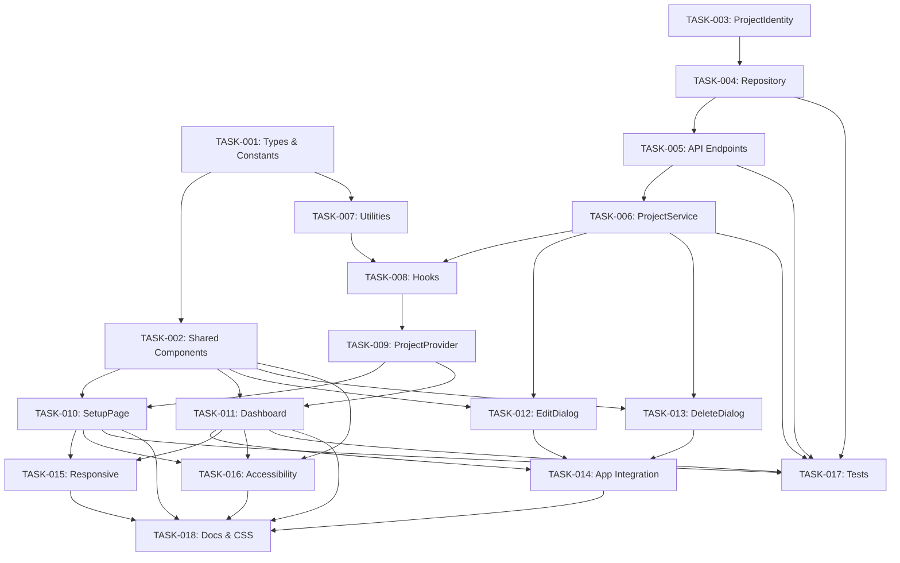

# TestForge — Sprint 01: Project Lifecycle Management

## Implementation Plan

**Document Version:** 2.0
**Sprint:** Sprint 01
**Date:** 2026-07-25
**Author:** Lead Product Architect

---

## 1. Overview

This document breaks down Sprint 01 into independent, completable tasks. Each task is designed to be completed in less than one day. Tasks are ordered by dependency and priority.

### 1.1 Task Summary

| Total Tasks | 18 |
|-------------|-----|
| Backend Tasks | 5 |
| Frontend Tasks | 10 |
| Testing Tasks | 2 |
| Documentation Tasks | 1 |

### 1.2 Task Status

| Status | Count |
|--------|-------|
| Not Started | 18 |
| In Progress | 0 |
| Completed | 0 |
| Blocked | 0 |

---

## 2. Task List

### TASK-001: Set up project types and constants

**Type:** Frontend  
**Priority:** P0  
**Complexity:** XS  
**Estimated Time:** 1 hour  
**Dependencies:** None

**Description:**
Add new TypeScript types and constants to the frontend codebase.

**Deliverables:**
- `UpdateProjectRequest` interface in `frontend/src/types/index.ts`
- `DeleteProjectResponse` interface in `frontend/src/types/index.ts`
- Enhanced `ListProjectsResponse` with `total`, `limit`, `offset` fields
- `ProjectContextValue` interface in `frontend/src/types/index.ts`
- New constants file: `frontend/src/utils/constants.ts`

**Acceptance Criteria:**
- All types compile without errors (`npm run typecheck` passes)
- Constants are exported and importable

---

### TASK-002: Create shared UI components

**Type:** Frontend  
**Priority:** P0  
**Complexity:** S  
**Estimated Time:** 3 hours  
**Dependencies:** TASK-001

**Description:**
Create reusable UI components: Modal, Button, Input, SearchBar, EmptyState, LoadingSpinner, ErrorBoundary.

**Deliverables:**
- `frontend/src/components/common/Modal.tsx`
- `frontend/src/components/common/Button.tsx`
- `frontend/src/components/common/Input.tsx`
- `frontend/src/components/common/SearchBar.tsx`
- `frontend/src/components/common/EmptyState.tsx`
- `frontend/src/components/common/LoadingSpinner.tsx`
- `frontend/src/components/common/ErrorBoundary.tsx`
- `frontend/src/components/common/index.ts` (barrel export)
- CSS styles for all components in `frontend/src/styles/index.css`

**Acceptance Criteria:**
- All components render without errors
- All components are accessible (ARIA attributes, keyboard navigation)
- All components work in both light and dark themes
- Components have proper TypeScript types

---

### TASK-003: Enhance ProjectIdentity domain model

**Type:** Backend  
**Priority:** P0  
**Complexity:** S  
**Estimated Time:** 2 hours  
**Dependencies:** None

**Description:**
Add validation functions and constants to the ProjectIdentity domain model.

**Deliverables:**
- Add `PROJECT_ID_PATTERN` constant to `src/domain/ProjectIdentity.js`
- Add `validateProjectId(id)` function
- Add `validateProjectName(name)` function
- Update `createProjectIdentity` to use new validation

**Acceptance Criteria:**
- `validateProjectId` rejects empty, too-long, and invalid-character IDs
- `validateProjectName` rejects empty names
- Existing tests still pass
- New validation is used in `createProjectIdentity`

---

### TASK-004: Add update and delete to ProjectRepository

**Type:** Backend  
**Priority:** P0  
**Complexity:** S  
**Estimated Time:** 3 hours  
**Dependencies:** TASK-003

**Description:**
Add `updateProject`, `deleteProject`, and `searchProjects` functions to the ProjectRepository abstraction and both implementations.

**Deliverables:**
- Add functions to `src/domain/ProjectRepository.js`
- Add functions to `src/domain/repositories/FileProjectRepository.js`
- Add functions to `src/domain/repositories/PostgresProjectRepository.js`
- Prevent deletion of default project
- Add search and sort to `listProjects`

**Acceptance Criteria:**
- `updateProject(id, { name })` updates the project name and `updatedAt`
- `deleteProject(id)` deletes the project file/row
- `deleteProject('default')` throws an error
- `searchProjects(query)` filters by ID and name
- `listProjects({ search, sort, order })` supports filtering and sorting
- Both file and PostgreSQL backends work identically

---

### TASK-005: Add backend API endpoints

**Type:** Backend  
**Priority:** P0  
**Complexity:** S  
**Estimated Time:** 3 hours  
**Dependencies:** TASK-004

**Description:**
Add PATCH and DELETE endpoints to the server, and enhance the GET and POST endpoints.

**Deliverables:**
- Add `PATCH /api/projects/:id` endpoint in `src/server.js`
- Add `DELETE /api/projects/:id` endpoint in `src/server.js`
- Enhance `GET /api/projects` with search/sort query parameters
- Enhance `POST /api/projects` with stricter validation
- Add proper error handling and HTTP status codes

**Acceptance Criteria:**
- `PATCH /api/projects/:id` returns 200 with updated project
- `PATCH /api/projects/:id` returns 404 for non-existent project
- `PATCH /api/projects/:id` returns 400 for empty name
- `DELETE /api/projects/:id` returns 200 with success message
- `DELETE /api/projects/:id` returns 400 for default project
- `DELETE /api/projects/:id` returns 404 for non-existent project
- `GET /api/projects?search=...` filters results
- `GET /api/projects?sort=name&order=desc` sorts results

---

### TASK-006: Enhance frontend ProjectService

**Type:** Frontend  
**Priority:** P0  
**Complexity:** S  
**Estimated Time:** 2 hours  
**Dependencies:** TASK-005

**Description:**
Add `updateProject`, `deleteProject`, and `searchProjects` functions to the frontend ProjectService.

**Deliverables:**
- Add `updateProject(projectId, data)` to `frontend/src/features/project-setup/ProjectService.ts`
- Add `deleteProject(projectId)` to `frontend/src/features/project-setup/ProjectService.ts`
- Add `searchProjects(query)` to `frontend/src/features/project-setup/ProjectService.ts`
- Enhance `listProjects(options)` with search/sort options

**Acceptance Criteria:**
- All functions call the correct API endpoints
- All functions return typed responses
- Error handling is consistent with existing patterns

---

### TASK-007: Create utility functions

**Type:** Frontend  
**Priority:** P0  
**Complexity:** XS  
**Estimated Time:** 1 hour  
**Dependencies:** TASK-001

**Description:**
Create validation and formatting utility functions.

**Deliverables:**
- `frontend/src/utils/validators.ts` — `validateProjectId`, `validateProjectName`
- `frontend/src/utils/formatDate.ts` — `formatDate`, `formatDateRelative`
- `frontend/src/utils/index.ts` — barrel export

**Acceptance Criteria:**
- `validateProjectId` returns null for valid IDs, error message for invalid
- `validateProjectName` returns null for valid names, error message for invalid
- `formatDate` formats dates as "Jan 15, 2025"
- All functions have TypeScript types
- All functions are exported

---

### TASK-008: Create custom hooks

**Type:** Frontend  
**Priority:** P0  
**Complexity:** S  
**Estimated Time:** 3 hours  
**Dependencies:** TASK-006

**Description:**
Create custom React hooks for project data fetching and utilities.

**Deliverables:**
- `frontend/src/hooks/useProjects.ts` — Fetch and manage projects list
- `frontend/src/hooks/useProject.ts` — Fetch single project by ID
- `frontend/src/hooks/useDebounce.ts` — Debounce a value
- `frontend/src/hooks/useLocalStorage.ts` — Sync state with localStorage
- Update `frontend/src/hooks/index.ts` with exports

**Acceptance Criteria:**
- `useProjects` fetches projects on mount and provides refetch
- `useProject` fetches a single project by ID
- `useDebounce` returns debounced value after delay
- `useLocalStorage` syncs state with localStorage
- All hooks have TypeScript types
- All hooks handle loading and error states

---

### TASK-009: Create ProjectProvider context

**Type:** Frontend  
**Priority:** P0  
**Complexity:** S  
**Estimated Time:** 2 hours  
**Dependencies:** TASK-008

**Description:**
Create React Context for project state management.

**Deliverables:**
- `frontend/src/features/project-setup/ProjectContext.ts` — Context definition
- Create `ProjectProvider` component
- Provide all project state and actions via context

**Acceptance Criteria:**
- `ProjectProvider` wraps the app and provides project state
- All context values are typed
- Context updates trigger re-renders in consumers
- Context handles loading and error states

---

### TASK-010: Enhance SetupPage with search and filtering

**Type:** Frontend  
**Priority:** P0  
**Complexity:** M  
**Estimated Time:** 4 hours  
**Dependencies:** TASK-002, TASK-008, TASK-009

**Description:**
Enhance the existing SetupPage with search, filtering, loading, and error states.

**Deliverables:**
- Add `SearchBar` to SetupPage
- Add search filtering logic (debounced)
- Add `EmptyState` for no results
- Add loading state (skeleton or spinner)
- Add error state with retry button
- Integrate with `ProjectProvider`
- Add keyboard shortcuts (Ctrl/Cmd + K for search focus)

**Acceptance Criteria:**
- Search filters projects in real-time (debounced 300ms)
- Search is case-insensitive and matches ID and name
- Empty state shows when no projects match search
- Loading state shows while fetching
- Error state shows with retry button
- Ctrl/Cmd + K focuses the search input
- All states are accessible

---

### TASK-011: Create ProjectDashboard

**Type:** Frontend  
**Priority:** P0  
**Complexity:** M  
**Estimated Time:** 4 hours  
**Dependencies:** TASK-002, TASK-008, TASK-009

**Description:**
Create the ProjectDashboard component with all sections.

**Deliverables:**
- `frontend/src/features/project-setup/ProjectDashboard.tsx`
- `DashboardHeader` — Project title, ID, dates, action buttons
- `ProjectStatusSection` — Status indicator
- `NextStepsSection` — Guidance cards
- Loading state (skeleton placeholders)
- Error state (redirect to setup)

**Acceptance Criteria:**
- Dashboard displays project name, ID, created/updated dates
- Status indicator shows "Not configured" (no APIs)
- Next steps section shows 3 steps with guidance
- Action buttons (Edit, Delete, Change Project) are present
- Loading state shows skeleton placeholders
- Error state redirects to setup page
- Dashboard loads within 500ms

---

### TASK-012: Create EditProjectDialog

**Type:** Frontend  
**Priority:** P1  
**Complexity:** S  
**Estimated Time:** 2 hours  
**Dependencies:** TASK-002, TASK-006

**Description:**
Create the EditProjectDialog modal component.

**Deliverables:**
- `frontend/src/features/project-setup/EditProjectDialog.tsx`
- Uses `Modal`, `Input`, and `Button` shared components
- Pre-fills with current project name
- Validates input (non-empty name)
- Shows loading state during save
- Shows error message on failure

**Acceptance Criteria:**
- Dialog opens from dashboard "Edit" button
- Input is pre-filled with current name
- Save button is disabled when input is empty
- Save button shows spinner during save
- Error message is displayed on failure
- Dialog closes on success
- Escape key closes dialog
- Focus is trapped within dialog

---

### TASK-013: Create DeleteProjectDialog

**Type:** Frontend  
**Priority:** P0  
**Complexity:** S  
**Estimated Time:** 2 hours  
**Dependencies:** TASK-002, TASK-006

**Description:**
Create the DeleteProjectDialog modal component.

**Deliverables:**
- `frontend/src/features/project-setup/DeleteProjectDialog.tsx`
- Uses `Modal`, `Input`, and `Button` shared components
- Shows project name and ID
- Requires user to type project ID to confirm
- Delete button disabled until ID matches
- Shows loading state during delete
- Shows error message on failure
- Prevents deletion of default project

**Acceptance Criteria:**
- Dialog opens from dashboard "Delete" button
- Project name and ID are displayed
- Delete button is disabled until input matches project ID exactly
- Visual feedback (green/red border) on input
- Delete button shows spinner during delete
- Error message is displayed on failure
- User is redirected to setup page on success
- Escape key closes dialog
- Focus is trapped within dialog

---

### TASK-014: Integrate ProjectDashboard into App

**Type:** Frontend  
**Priority:** P0  
**Complexity:** S  
**Estimated Time:** 2 hours  
**Dependencies:** TASK-009, TASK-011, TASK-012, TASK-013

**Description:**
Integrate the ProjectDashboard into the App component and set up routing.

**Deliverables:**
- Update `App.tsx` to render `ProjectDashboard` when a project is active
- Update `App.tsx` to render `SetupPage` when no project is active
- Add hash-based routing for project context
- Wrap app in `ProjectProvider`
- Update `Header` to show active project name
- Update `Sidebar` with project-specific nav items

**Acceptance Criteria:**
- App renders SetupPage when no project is active
- App renders ProjectDashboard when a project is active
- URL hash reflects current view and project
- Page reload preserves active project
- Header shows active project name
- Sidebar shows project-specific nav items
- Back button works correctly

---

### TASK-015: Add responsive design

**Type:** Frontend  
**Priority:** P1  
**Complexity:** S  
**Estimated Time:** 3 hours  
**Dependencies:** TASK-010, TASK-011

**Description:**
Add responsive design for mobile and tablet screens.

**Deliverables:**
- Add media queries to `frontend/src/styles/index.css`
- Hide sidebar on mobile (≤ 768px)
- Add hamburger menu toggle for mobile
- Stack form fields vertically on mobile
- Make dashboard action buttons stack on mobile
- Ensure touch targets are ≥ 44px
- Test on various screen sizes

**Acceptance Criteria:**
- SetupPage works on screens ≥ 360px
- Dashboard works on screens ≥ 360px
- Form fields stack vertically on mobile
- Sidebar is hidden on mobile with hamburger toggle
- Touch targets are ≥ 44px
- Font size is readable without zooming
- Create button is full-width on mobile

---

### TASK-016: Add accessibility features

**Type:** Frontend  
**Priority:** P1  
**Complexity:** M  
**Estimated Time:** 4 hours  
**Dependencies:** TASK-002, TASK-010, TASK-011

**Description:**
Add accessibility features to all components.

**Deliverables:**
- Add ARIA attributes to all components
- Add focus indicators
- Add keyboard navigation
- Add focus traps for modals
- Add aria-live for dynamic updates
- Ensure color contrast meets WCAG 2.1 AA
- Add skip link for keyboard users

**Acceptance Criteria:**
- All interactive elements are keyboard-navigable
- All interactive elements have visible focus indicators
- All form fields have associated labels
- All icons have aria-hidden or aria-label
- Modal dialogs have role="dialog" and aria-modal="true"
- Color contrast meets 4.5:1 for normal text
- Keyboard shortcuts work (Tab, Enter, Escape, Arrow keys)

---

### TASK-017: Write tests

**Type:** Testing  
**Priority:** P1  
**Complexity:** M  
**Estimated Time:** 4 hours  
**Dependencies:** TASK-004, TASK-005, TASK-006, TASK-010, TASK-011

**Description:**
Write unit and integration tests for backend and frontend.

**Deliverables:**
- Backend tests: `test-domain-ProjectIdentity-validation.js`
- Backend tests: `test-api-project-crud.js`
- Frontend tests: `frontend/src/features/project-setup/ProjectDashboard.test.tsx`
- Frontend tests: `frontend/src/features/project-setup/SetupPage.test.tsx`
- Frontend tests: `frontend/src/components/common/Modal.test.tsx`
- Frontend tests: `frontend/src/components/common/Input.test.tsx`

**Acceptance Criteria:**
- Backend tests cover all new functions (create, get, list, update, delete, search)
- Frontend tests cover all new components
- Test coverage ≥ 80% for new code
- All tests pass (`npm test`)

---

### TASK-018: Update documentation and CSS

**Type:** Documentation  
**Priority:** P1  
**Complexity:** S  
**Estimated Time:** 2 hours  
**Dependencies:** All other tasks

**Description:**
Add CSS styles for new components and update documentation.

**Deliverables:**
- Add CSS styles for Modal, Button, Input, SearchBar, EmptyState, LoadingSpinner
- Add CSS styles for ProjectDashboard
- Add CSS styles for EditProjectDialog and DeleteProjectDialog
- Add responsive media queries
- Add dark/light theme variables for new components
- Update README with new endpoints

**Acceptance Criteria:**
- All new components have CSS styles
- All components work in both light and dark themes
- Responsive media queries are in place
- CSS variables are consistent with existing design system
- README documents new API endpoints

---

## 3. Task Dependencies

---

## 4. Sprint Timeline

### Week 1: Foundation

| Day | Tasks |
|-----|-------|
| Day 1 | TASK-001, TASK-003, TASK-007 |
| Day 2 | TASK-002, TASK-004 |
| Day 3 | TASK-005, TASK-006 |
| Day 4 | TASK-008, TASK-009 |
| Day 5 | TASK-010 |

### Week 2: Features and Polish

| Day | Tasks |
|-----|-------|
| Day 6 | TASK-011 |
| Day 7 | TASK-012, TASK-013 |
| Day 8 | TASK-014 |
| Day 9 | TASK-015, TASK-016 |
| Day 10 | TASK-017, TASK-018 |

---

## 5. Task Assignment

| Task | Role | Notes |
|------|------|-------|
| TASK-001 | Frontend Engineer | TypeScript types |
| TASK-002 | Frontend Engineer | Shared components |
| TASK-003 | Backend Engineer | Domain validation |
| TASK-004 | Backend Engineer | Repository functions |
| TASK-005 | Backend Engineer | API endpoints |
| TASK-006 | Frontend Engineer | Service layer |
| TASK-007 | Frontend Engineer | Utilities |
| TASK-008 | Frontend Engineer | React hooks |
| TASK-009 | Frontend Engineer | Context/Provider |
| TASK-010 | Frontend Engineer | SetupPage enhancement |
| TASK-011 | Frontend Engineer | Dashboard |
| TASK-012 | Frontend Engineer | Edit dialog |
| TASK-013 | Frontend Engineer | Delete dialog |
| TASK-014 | Frontend Engineer | App integration |
| TASK-015 | Frontend Engineer | Responsive design |
| TASK-016 | Frontend Engineer | Accessibility |
| TASK-017 | QA Engineer | Tests |
| TASK-018 | Frontend Engineer | CSS & docs |

---

## 6. Risk Assessment

| Risk | Probability | Impact | Mitigation |
|------|-------------|--------|------------|
| Backend validation breaks existing projects | Low | High | Run existing tests before deployment |
| Modal focus trap doesn't work in all browsers | Medium | Medium | Test in Chrome, Firefox, Safari, Edge |
| Search performance with 500+ projects | Low | Medium | Add pagination if needed |
| Dark mode colors don't match design | Medium | Low | Use CSS variables consistently |
| PostgreSQL trigger doesn't work | Low | Medium | Test with PG_ENABLED=true |
| Accessibility audit fails | Medium | Medium | Use axe-core for automated testing |
| Bundle size exceeds 10KB increase | Low | Low | Use code splitting if needed |

---

## 7. Definition of Ready (for each task)

Each task must meet the following criteria before work begins:

- [ ] Task description is clear and complete
- [ ] Acceptance criteria are defined
- [ ] Dependencies are identified and completed
- [ ] Deliverables are specified
- [ ] Task can be completed in < 1 day

---

## 8. Definition of Done (for each task)

Each task is considered complete when:

- [ ] All deliverables are implemented
- [ ] All acceptance criteria are met
- [ ] Code compiles without errors
- [ ] Tests pass (if applicable)
- [ ] Code is reviewed (if applicable)
- [ ] Documentation is updated (if applicable)

---

*End of Implementation Plan — Sprint 01: Project Lifecycle Management*
</parameter>
<task_progress>
- [x] Read all 10 Sprint 01 docs
- [x] Update 01_PRD.md for Project Lifecycle Management
- [x] Update 02_User_Stories.md
- [x] Update 03_UX_Specification.md
- [x] Update 04_Technical_Design.md
- [x] Update 05_API_Contracts.md
- [x] Update 06_Database_Model.md
- [ ] Update 07_Component_Breakdown.md
- [ ] Update 08_Implementation_Plan.md
- [ ] Update 09_AI_Implementation_Prompts.md
- [ ] Update 10_Definition_of_Done.md
- [ ] Produce changelog and readiness recommendation
</task_progress>
</write_to_file>